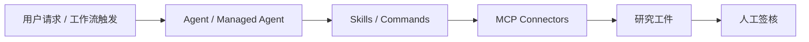
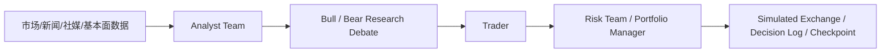

# Reference Project Map

This project treats `anthropics/financial-services` and TradingAgents as
research-layer references, not as executable crypto futures engines.

## Anthropic Reference Mapping

Implementation mapping:

- `events` records each workflow stage as an auditable artifact source.
- `/api/state.research.protocol` describes input treatment, exchange format,
  decision memory, and review rules.
- `/api/state.research.guardrails` makes the non-execution boundary visible.
- Future external news, social, or report connectors must treat third-party text
  as untrusted data and mark missing sources explicitly.
- Future market-researcher skills should map to sector-overview,
  competitive-analysis, comps-analysis, and idea-generation equivalents, with
  missing figures marked as `UNSOURCED` rather than estimated.

## TradingAgents Reference Mapping

Implementation mapping:

- `Market Analyst`, `Sentiment Analyst`, and `News Analyst` correspond to the
  analyst team, with explicit gaps for news, social, and fundamental data.
- The full role map is fundamental analyst, sentiment analyst, news analyst,
  technical analyst, researcher, trader, and risk manager.
- `bull-bear-debate` is represented as a deterministic structured artifact so
  conclusions stay auditable.
- `Trader Agent` produces only `TradeIntent`.
- `Risk Engine` acts as the deterministic risk and portfolio review gate.
- Paper execution, SQLite events, and `order_transitions` provide the current
  simulated exchange, decision log, and recovery evidence.

## Non-Goals

- No live trading.
- No LLM direct order mutation.
- No exchange secret exposure to agents or the browser.
- No assumption that TradingAgents backtest behavior transfers to crypto
  perpetual futures without separate simulation, testnet, and recovery testing.
